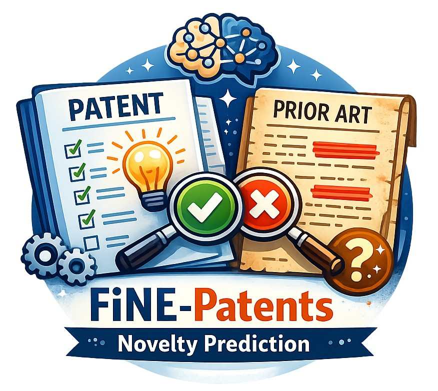

<p align="center">
  
</p>

<h1 align="center">FiNE-Patents</h1>

<p align="center">
  <strong>🔍 Is It Novel and Why? Fine-Grained Patent Novelty Prediction Based on Passage Retrieval</strong>
</p>

<p align="center">
  Valentin Knappich, Anna Hätty, Simon Razniewski, and Annemarie Friedrich<br>
  <em>SIGIR 2026</em>
</p>

<p align="center">
  <a href="https://doi.org/10.1145/3805712.3809576"></a>
  <a href="LICENSE-CODE"></a>
  <a href="LICENSE-DATA"></a>
</p>

---

## Setup

### Unpack data

```
tar xvzf data/packaged.tar.gz
```

### Install dependencies

```
uv sync
```


## Overview

FiNE-Patents frames patent novelty prediction as a *fine-grained*, evidence-based
task: given a patent application and its closest prior art, the goal is not only to
predict whether claim 1 is **novel**, but also to ground that decision in the
specific prior-art passages that anticipate each claim feature.

The repository contains three things:

- **📂 The dataset** — packaged under `data/packaged/`, with one directory per EPO
  patent application (e.g. `EP12000049/`).
- **🛠️ The dataset creation pipeline** — the numbered `sXYZ_*` scripts in
  `src/whats_novel/dataset/` that build the dataset from raw EPO data.
- **🧪 The novelty prediction & evaluation code** — the modules in
  `src/whats_novel/novelty_classification/`.

### Project structure

```
src/whats_novel/
├── dataset/                    # Dataset model + creation pipeline
│   ├── data_model.py           # Pydantic schema (ApplicationData, ClaimBreakdown, ...)
│   ├── __init__.py             # load_dataset / load_dataset_async helpers
│   └── s0XY_*.py               # Numbered pipeline steps (see below)
├── novelty_classification/     # Prediction methods + evaluation
│   ├── main.py                 # ▶ Run novelty examination over the dataset
│   ├── evaluate.py             # ▶ Compute metrics for one or more runs
│   ├── single_step.py          # Single-step LLM examination (default method)
│   ├── hierarchical_examination.py  # Retrieval-based hierarchical method
│   ├── baselines.py            # Random / embedding / BERT / ROUGE / LLM baselines
│   └── shared.py               # Shared DSPy signatures and output types
└── utils/                      # Logging, async, plotting, adapters

data/
└── packaged/                   # The FiNE-Patents dataset (one dir per application)
```

Each application directory in `data/packaged/` contains:

| File | Description |
|------|-------------|
| `rejected_patent.json` | The application as filed / rejected |
| `granted_patent.json` | The granted version of the patent |
| `cited_patent.json` | The closest cited prior-art document |
| `breakdown.json` | Claim 1 broken into features, each linked to prior-art passages |
| `breakdown.md` | Human-readable rendering of the breakdown |
| `metadata.json` | Split (`train`/`val`/`test`) and included versions |

## Entrypoints

### Predicting novelty

First serve a model with an OpenAI-compatible endpoint (e.g. via vLLM), then run
the examination over the dataset:

```bash
uv run python -m whats_novel.novelty_classification.main \
  --api_base http://localhost:59535/v1 \
  --module SingleStepNoveltyExamination
```

Key options (parsed via [hydralette](https://pypi.org/project/hydralette/), passed
as `--key value` on the command line):

- `module` — the prediction method: `SingleStepNoveltyExamination` (default),
  `HierarchicalExamination`, or a baseline from `baselines.py`
  (`RandomNoveltyExamination`, `EmbeddingSimilarity`, `BERT`, `RougeSimilarity`,
  `SpuriousLLM`, ...).
- `api_base` / `model` — the inference endpoint and model name.
- `dataset_path` — defaults to `data/packaged`.
- `n_workers` — number of concurrent workers.

Each run writes its predictions and logs to a new directory under
`data/logs/novelty_classification/run_*`.

### Evaluating runs

Compute novelty-classification and passage-retrieval metrics for one or more runs:

```bash
uv run python -m whats_novel.novelty_classification.evaluate \
  --run_dirs data/logs/novelty_classification/run_...
```

By default it evaluates all `run*` directories under
`data/logs/novelty_classification/`.

### Recreating the dataset

The dataset creation pipeline lives in `src/whats_novel/dataset/` and runs as an
ordered sequence of numbered steps (requires EPO OPS API credentials). Run them in
order:

```bash
uv run python -m whats_novel.dataset.s010_get_application_numbers   # collect application numbers
uv run python -m whats_novel.dataset.s021_download_topics           # download search reports / topics
uv run python -m whats_novel.dataset.s022_parse_topics
uv run python -m whats_novel.dataset.s031_download_rejection        # download examination rejections
uv run python -m whats_novel.dataset.s032_ocr_rejection             # OCR scanned rejections
uv run python -m whats_novel.dataset.s033_filter_rejections
uv run python -m whats_novel.dataset.s041_parse_rejection           # extract claim breakdowns
uv run python -m whats_novel.dataset.s042_label_rejection           # label novelty / prior-art passages
uv run python -m whats_novel.dataset.s043_train_prompt              # (optional) DSPy prompt optimization
uv run python -m whats_novel.dataset.s051_download_cited            # download cited prior art
uv run python -m whats_novel.dataset.s052_package                   # assemble data/packaged/
```

Most users can skip this and use the packaged dataset directly.

### Loading the dataset in Python

```python
from pathlib import Path

from whats_novel.dataset import load_dataset

# Returns a dict keyed by split: {"train": [...], "val": [...], "test": [...]}
dataset = load_dataset(Path("data/packaged"))
for entry in dataset["test"]:
    sample = entry["sample"]          # ApplicationData
    print(sample.app_num, sample.breakdown)
```

---

## 📖 Citation

If you use this work, please cite:

> Valentin Knappich, Anna Hätty, Simon Razniewski, and Annemarie Friedrich. 2026. Is It Novel and Why? Fine-Grained Patent Novelty Prediction Based on Passage Retrieval. In *Proceedings of the 49th International ACM SIGIR Conference on Research and Development in Information Retrieval (SIGIR ’26), July 20–24, 2026, Melbourne, VIC, Australia.* ACM, New York, NY, USA, 12 pages.

```bibtex
@inproceedings{knappich2026novel,
    author = {Knappich, Valentin and H{\"a}tty, Anna and Razniewski, Simon and Friedrich, Annemarie},
    title = {Is It Novel and Why? Fine-Grained Patent Novelty Prediction Based on Passage Retrieval},
    year = {2026},
    publisher = {Association for Computing Machinery},
    address = {New York, NY, USA},
    url = {https://doi.org/10.1145/3805712.3809576},
    doi = {10.1145/3805712.3809576},
    isbn = {9798400715921},
    booktitle = {Proceedings of the 49th International ACM SIGIR Conference on Research and Development in Information Retrieval},
    location = {Melbourne, VIC, Australia},
    series = {SIGIR '26},
    keywords = {Large Language Models, LLM, Passage Retrieval, Patent Analysis, Novelty Prediction, Explainable AI}
}
```

---

## ⚖️ License

| Component | License |
|-----------|---------|
| Code | [MIT](LICENSE-CODE) |
| Data | [CC-BY-4.0](LICENSE-DATA) |
